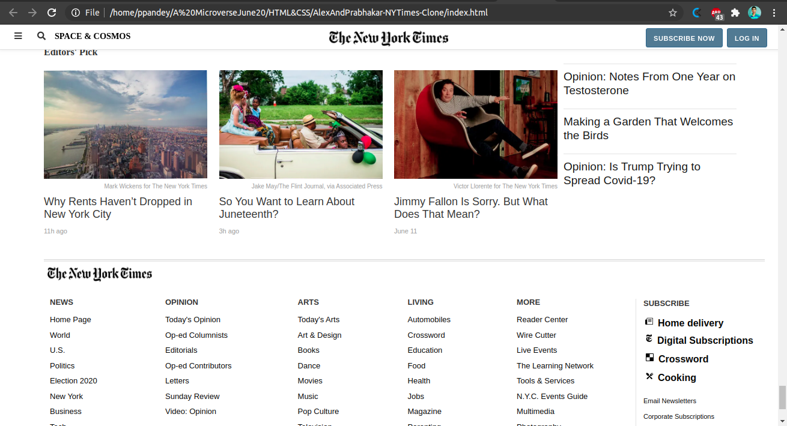

# PrabhakarAndAlex-Old-Apple.com-Clone
This project is focused on learning gradient and background image positioning using CSS. In this project we're required to create clone of Old Apple.com's homepage.

In this task we were required to create a clone of old Apple.com's home page using the best practices of HTML AND CSS with GitHub process flow.

## Built With

- HTML,
- CSS3,

## Live Demo

[Live Demo Link](https://rawcdn.githack.com/Prabhakarzx/PrabhakarAndAlex-Old-Apple.com-Clone/460c9b88dcf0675cefea6bb624e76ced6fe7a618/Index.html)

## Authors

👤 Alexandre Bouhid

- Github: [@githubhandle](https://github.com/abouhid)
- Twitter:
- LinkedIn:

👤 Prabhakar Pandey

- Github: [@githubhandle](https://github.com/Prabhakarzx)
- Twitter: [@twitterhandle](https://twitter.com/prabhakarzx)
- Linkedin: [linkedin](https://www.linkedin.com/in/prabhakarzx/)

## 🤝 Contributing

Contributions, issues and feature requests are welcome!

Feel free to check the [issues page](https://github.com/Prabhakarzx/PrabhakarAndAlex-Old-Apple.com-Clone/issues)

## Show your support

Give a ⭐️ if you like this project!

## Acknowledgments

- Microverse
- GitHub
- TheOdinProject

## 📝 License

This project is open licensed.
